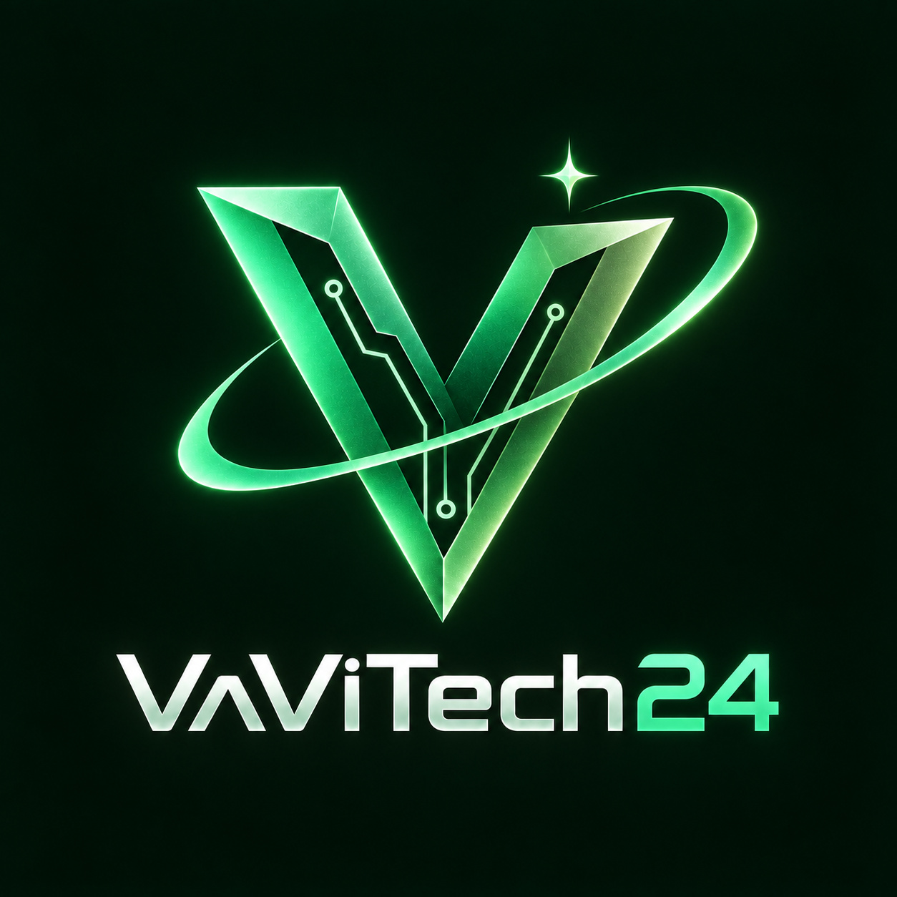
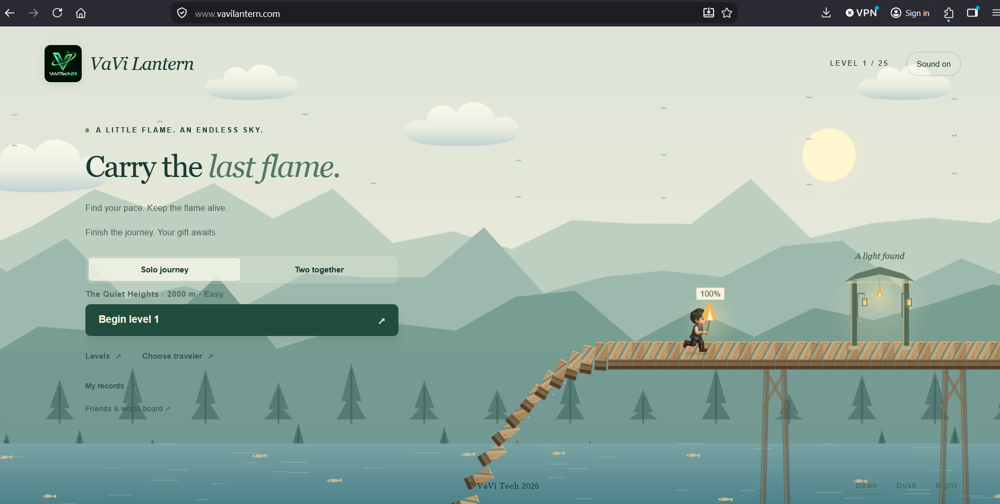

# VaVi Lantern

A serene game by VaViTech24: carry the last flame the world falls away behind you, find your pace keep the flame alive, finish the journey across 25 calm and relaxing levels.<br>

<p align="center">
  
</p>

Walk to restore your torch, sprint to escape the collapsing bridge, and time your jumps across 25 progressively longer levels. Choose Jonah, Junnu, Prem, Chinnu, Joel or Pranay. Play solo or share one device on two bridges.

## Screenshots



[View the screenshot gallery](docs/SCREENSHOTS.md) for desktop and portrait mobile views of travelers, level selection, collapsing bridges, the finish gateway, and dusk and night scenery. Screenshots supplied September 8–9, 2026.

## Technologies used

| Layer | Technology / version | Purpose |
|---|---|---|
| Interface | HTML5 and CSS3 | Menus, HUD, dialogs, responsive touch controls |
| Rendering | Canvas 2D | Bridge, parallax scenery, fireballs, water, flame and characters |
| Game logic | Plain JavaScript | Shared deterministic rules and fixed 60 Hz runtime simulation |
| Character art | PNG sprite atlas and Canvas geometry | Complete Jonah poses and procedural companions |
| Sound | Web Audio API | Oscillators, noise, envelopes and lifecycle-aware effects |
| Local persistence | Web Storage localStorage | Device/origin-specific settings, levels and records |
| Android shell | Java 17 and Android System WebView | Packaged web game, virtual HTTPS assets and lifecycle |
| Android package | com.vavitech24.lantern | App identifier; API 26 minimum, SDK 36 target/compile |
| Android build | Gradle 8.13 and AGP 8.13.2 | Debug APK and unsigned release AAB |
| Server | Node.js 22 LTS, built-in HTTP/crypto/fs | Optional rooms, authoritative simulation and static files |
| Networking | JSON over HTTP(S), polling around 10 Hz | Input updates and server snapshots |
| Server storage | JSON file, temporary write plus rename | Single-process top-run persistence |
| Container | node:22-alpine, non-root user | Optional API deployment with mounted data directory |
| Testing | Node assert/vm and local HTTP | Mechanics, UI smoke, audio lifecycle and API checks |
| Website build | Node file-copy allowlist | Creates a portable static dist directory |
| Source/distribution | Git and GitHub Releases | Organization repository and versioned binaries |
| Domain ownership | Cloudflare Registrar | Registers and renews vavilantern.com |
| Domain routing | Cloudflare authoritative DNS, A/CNAME/TXT | DNS-only routing and domain verification for apex and www |
| Public website hosting | ChatGPT Sites | Saved versions, static deployment and custom-domain HTTPS |
| Hosted delivery | Sites-managed Cloudflare infrastructure | TLS and delivery of public game assets; separate from the owner's DNS zone |
| Architecture docs | Mermaid in Markdown and .mmd sources | GitHub-rendered context, sequence, state and delivery diagrams |

The client and optional server use no npm runtime dependencies. Rendering is Canvas 2D; React, Unity, Unreal and Firebase are not used. [Technology details](docs/TECHNOLOGIES.md) · [Cloudflare and ChatGPT Sites hosting](docs/HOSTING.md).

## How your domain reaches the game

[Domain routing explained](docs/DOMAIN-ROUTING.md) covers who owns the Cloudflare IP addresses, how Sites supplied the A-record targets, where the hostname mapping was configured, how DNS/TLS/HTTP select the game, and where scripts are stored and executed. Includes three step-by-step diagrams.

## Live game and hosting

Play at [vavilantern.com](https://vavilantern.com), [www.vavilantern.com](https://www.vavilantern.com), or the [ChatGPT Sites address](https://vavi-lantern.prashanth991.chatgpt.site). Cloudflare manages the domain and DNS; ChatGPT Sites serves the same game at all three addresses. Manage the hosted game in [ChatGPT Sites](https://chatgpt.com/sites). Progress is local to each browser and hostname.

**HTTPS certificates:** Both custom domains have active SSL certificates, verified September 9, 2026 at 00:25 UTC. Sites manages certificate provisioning; no separate certificate purchase or manual installation is needed. See [certificate status and management](docs/HOSTING.md#https-certificates).

## Run and build

Use Node.js 22 LTS for development. The game and optional Node service have no npm runtime dependencies.

```sh
npm start
# Open http://localhost:8787
npm test
node tests/playability.cjs
npm run build
# dist/ contains the deployable static website
```

Android: open this repository in Android Studio, use JDK 17 and install Android SDK 36. Build with:

```sh
./gradlew assembleDebug bundleRelease
# Windows: gradlew.bat assembleDebug bundleRelease
```

Download the latest app from [GitHub Releases](https://github.com/VaVi-Tech24/VaViLantern/releases). The APK is development-signed; the AAB is unsigned and needs your upload-key signature before Play submission. GitHub publication does not publish the game to Google Play.

## Repository layout

```text
web/public/       Shared browser game, renderer, sound and artwork
app/              Android Java wrapper and resources; consumes web/public
server/           Optional Node race API and Dockerfile
tests/            Mechanics, UI, sound, HTTP and playability checks
scripts/          Website build and release tooling
docs/             Architecture, code map, technologies and user guides
docs/diagrams/    Standalone Mermaid diagram sources
docs/history/     Archived development notes
gradle/           Reproducible Android build wrapper
assets/           Original/reference artwork
```

## Controls

| Action | Touch | Keyboard P1 | Keyboard P2 |
|---|---|---|---|
| Sprint | Hold playfield or Sprint | Shift / Right | D |
| Jump / air boost | Tap playfield or Jump | Space / Up | W |
| Slide | Swipe down or Slide | Down | S |
| Pause | Pause | Escape | Shared pause |

Jump limits are 3 at levels 1–5, 4 at 6–10, 5 at 11–19, and 6 at 20–25. Three lantern posts refill the flame per level. Death restarts the current level from its beginning; completing it unlocks the next. There is no ghost mode or mid-level resume.

## Documentation

| Guide | Contents |
|---|---|
| [How to play](docs/HOW-TO-PLAY.md) | Player guide, controls and tips |
| [Features](docs/FEATURES.md) | Implemented features and current scope |
| [Technologies](docs/TECHNOLOGIES.md) | Stack, versions and design choices |
| [Architecture](docs/ARCHITECTURE.md) | End-to-end component, game loop, multiplayer and delivery diagrams |
| [Code map](docs/CODE-MAP.md) | File responsibilities, entry points and change recipes |
| [Game design](docs/GAME-DESIGN.md) | Campaign, physics, scoring and characters |
| [Development and skills](docs/DEVELOPMENT.md) | Setup, engineering skills, workflows and validation |
| [API](docs/API.md) | Online routes, sessions, data and limits |
| [Cloudflare and ChatGPT Sites](docs/HOSTING.md) | Live addresses, hosting ownership, DNS, HTTPS, publishing, rollback and troubleshooting |
| [Deployment](docs/DEPLOYMENT.md) | Website, optional server and Android distribution |
| [Releases](docs/RELEASES.md) | Latest binaries, checksums and version policy |
| [Play Store preparation](docs/PUBLISHING.md) | Signing, listing and submission guide |
| [Privacy draft](docs/PRIVACY.md) | Actual data behavior and remaining policy placeholders |
| [Release checklist](docs/RELEASE-CHECKLIST.md) | Validation and work before production |

## Current delivery status

- Solo and same-device multiplayer work in the browser and bundled Android app.
- Play the published website at [vavilantern.com](https://vavilantern.com) or [www.vavilantern.com](https://www.vavilantern.com). HTTPS is active; solo and same-device multiplayer are available.
- Optional Node invitation races and a seven-day board are implemented but not publicly hosted. Static hosting alone does not enable them.
- No ads, purchases, cash rewards, player accounts or cross-device synchronization are implemented.
- Art combines supplied references, generated bitmaps and Canvas drawing. This is a 2D game with shaded effects, not a native 3D engine.

No open-source license has been selected. Public repository visibility alone does not grant reuse rights to code or artwork. Historical VERSION files describe their individual revisions; the documentation above describes the current implementation. [Early notes](docs/history/EARLY-DEVELOPMENT-NOTES.md) are retained only as development history and contain superseded features.
