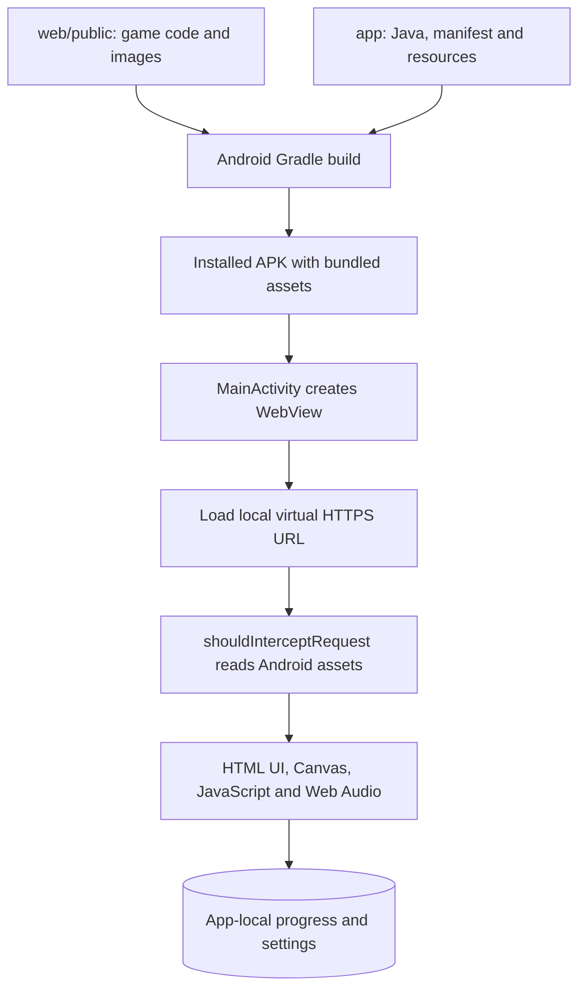

# Android app: packaging, runtime and updates

VaVi Lantern is a WebView-based Android game. The Android layer is written in Java; the game itself uses the same HTML, CSS, JavaScript and images as the website. One Java activity is sufficient because gameplay runs in WebView rather than being implemented in Java.

## Where the code lives

| Path | Responsibility |
|---|---|
| `app/src/main/java/com/vavitech24/lantern/MainActivity.java` | Creates WebView, serves bundled assets, handles lifecycle, Back and orientation requests |
| `app/src/main/AndroidManifest.xml` | Android application, activity and permissions |
| `app/src/main/res/` | Launcher artwork, adaptive icon, colors and styles |
| `app/build.gradle` | Android version, SDK settings and shared asset inclusion |
| `web/public/index.html` and CSS | Home screen, menus, controls and layout |
| `web/public/game.js` | Canvas scenery, game screens, input and gesture guidance |
| `web/public/engine.js` | Levels, movement, collisions and game rules |
| `web/public/characters.js` | Character rendering |
| `web/public/sound.js` | Synthesized game audio |
| `web/public/online.js` | Website-only networking; excluded from Android |
| Root Gradle files and `gradle/` | Project configuration and build wrapper |

The `app/` folder is an Android module, not a standalone copy of the entire project. Clone the **whole repository** and open its root in Android Studio.

## How the game enters the APK

The prepareOfflineAssets task copies shared web files, excludes online.js, and substitutes app/src/offline/offline.js to add the privacy link. The following setting in `app/build.gradle` packages `web/public/` as Android assets:

```gradle
sourceSets { main { assets.srcDirs = [layout.buildDirectory.dir('generated/offlineAssets')] } }
```

JavaScript, HTML, CSS and images are included during the build. The Node server in `server/` is not bundled as a running backend. Android does not need Node.js installed to play.



## Does the first launch contact the website?

**No.** MainActivity loads `https://appassets.androidplatform.net/index.html`. For this origin, its request interceptor returns files using `getAssets().open(...)` from the installed APK. This is a virtual local HTTPS origin, not a request to download the game from `vavilantern.com`, ChatGPT Sites or Cloudflare. First launch and later launches use the same local loading mechanism.

Solo and same-device two-player modes work offline. Build 32 and later omit online races and the world board, exclude online.js, have no INTERNET permission, and block external resource requests. Only solo and same-device two-player modes are included.

Progress and settings use WebView localStorage. They are separate from the browser website's storage and are not automatically synchronized. Clearing app data or uninstalling can remove local progress.

## Android-specific behavior

- The activity enables JavaScript and DOM storage, while disabling WebView file and content access.
- Backgrounding the activity requests a game pause and pauses WebView timers. Returning resumes WebView timers; the game has its own resume controls.
- Back pauses an active game or returns to the home screen.
- Landscape and auto-rotation requests use handled `vavi://landscape` and `vavi://auto` navigation URLs. There is no `addJavascriptInterface` object; MainActivity does use `evaluateJavascript` for lifecycle notifications and the Android flag.
- The launcher artwork and the VaViTech24 in-game header logo are separate assets.

## Website updates versus app updates

| Change | Delivery |
|---|---|
| Publish website changes | Updates the hosted website; installed APK contents remain unchanged |
| Change shared game files | Rebuild Android to include the changes in the app |
| Change launcher icon or Android behavior | Rebuild Android |
| Publish source on GitHub | Makes code available; does not update installed apps |
| Distribute an updated app | Install the new APK or deliver an appropriately signed Play Store update |

There is no automatic download of newer game scripts from the live website. Keep the application ID and compatible signing identity when distributing updates, and increase Android `versionCode` for new releases.

## Build and downloads

See [development prerequisites](DEVELOPMENT.md) for Android Studio, JDK 17 and SDK setup. From the repository root on Windows:

```powershell
.\gradlew.bat assembleDebug bundleRelease
```

The debug APK is written to `app/build/outputs/apk/debug/app-debug.apk`; the release bundle is written to `app/build/outputs/bundle/release/app-release.aab`. The current project does not configure a production release signing key. GitHub test APKs are development-signed, and an unsigned release bundle needs signing before Play submission.

See [Android releases](RELEASES.md) for the latest APK and checksum, and [publishing guidance](PUBLISHING.md) for store preparation. Build outputs, local SDK installations and signing secrets are deliberately excluded from source control.
