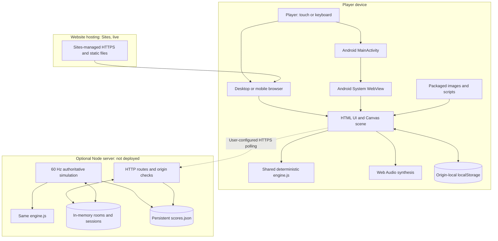
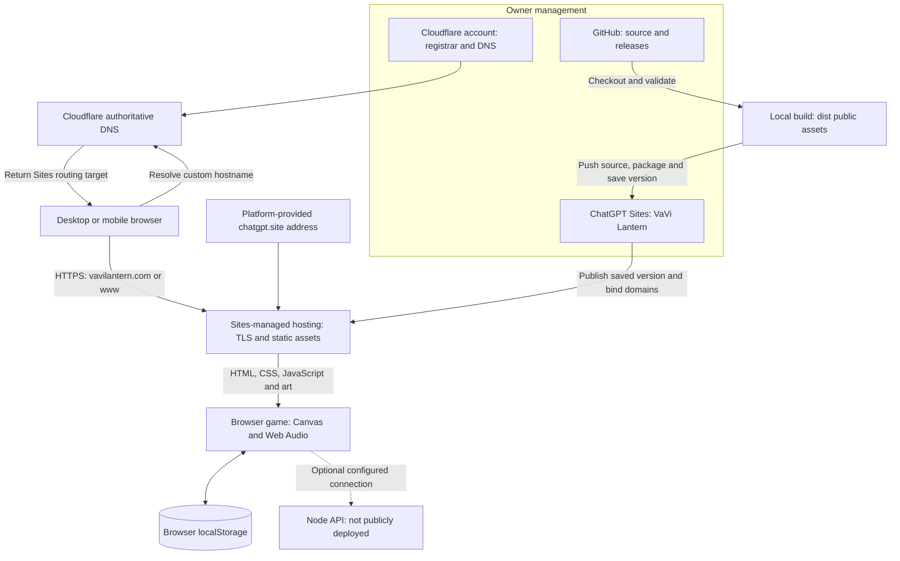
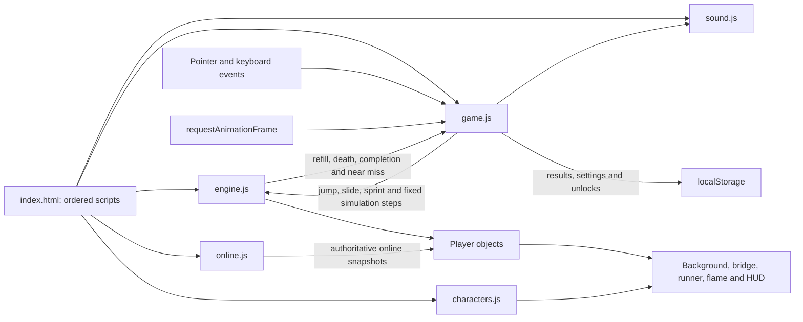
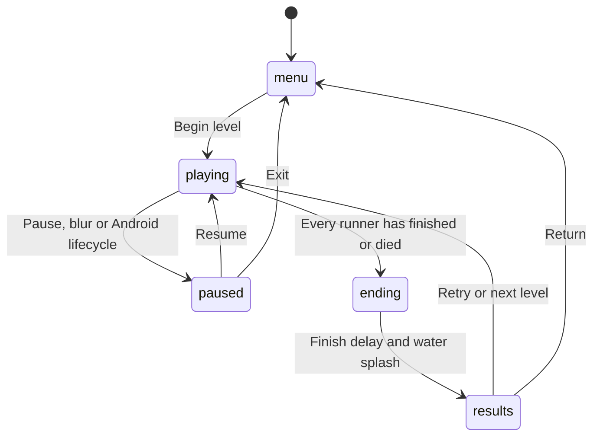
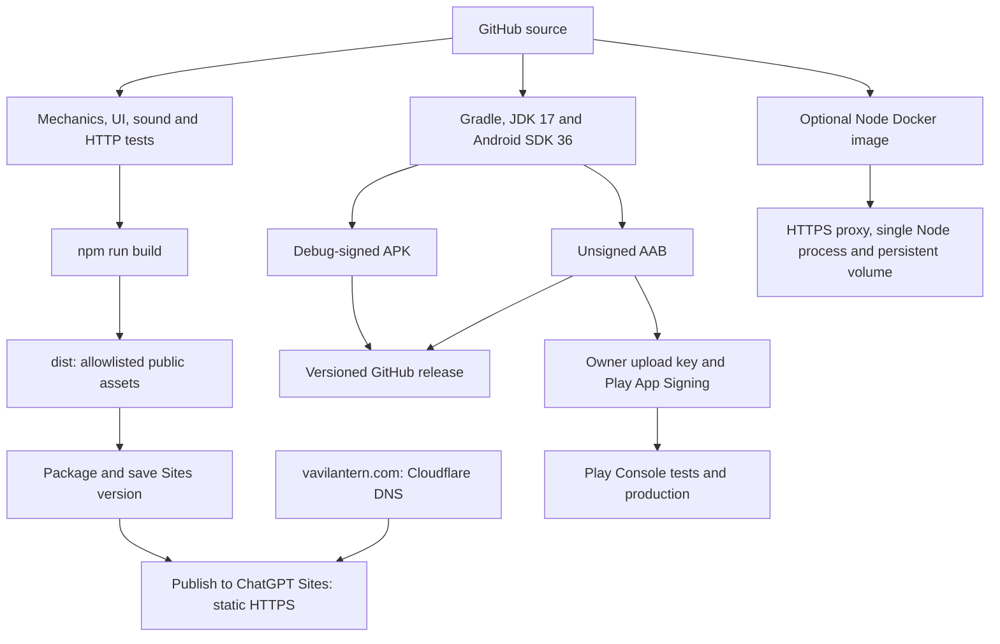

# End-to-end architecture

The same JavaScript game runs in a browser and Android System WebView. There is no native physics engine or `addJavascriptInterface` object. Android handles orientation navigation requests and sends lifecycle notifications through `evaluateJavascript`. Local gameplay has no external API dependency. The optional Node service imports the same physics module. See the [Android app guide](ANDROID.md) for packaging, first launch, offline behavior and updates.

## System and trust boundaries



Android intercepts requests to `https://appassets.androidplatform.net` and reads its packaged assets. A browser downloads identical assets from a static host or from the optional Node server. Website hosting, domain registration and online API hosting are separate services.

## Live Cloudflare and ChatGPT Sites infrastructure

Cloudflare Registrar and DNS are managed in the owner's account. ChatGPT Sites manages the live static deployment and custom-domain certificates. The apex, www and platform-provided address serve the same application. The owner's DNS records are DNS only; the Sites-managed Cloudflare delivery infrastructure is a separate service boundary, not a Worker or Pages project in the owner's account.


The static host serves twelve allowlisted website files plus deployment metadata. It does not run server/server.cjs or store player progress. Local gameplay executes on the device; localStorage is isolated per origin. DNS verification and HTTPS activation connect the custom domains to the saved deployment. Source pushes, saved Sites versions, production deployment and Android releases are distinct steps. See [Hosting operations](HOSTING.md) for DNS targets, dashboard links, update and rollback procedures, and renewal responsibilities.

## Detailed domain and script flows

The [domain-routing guide](DOMAIN-ROUTING.md) expands the hosting boundary into three diagrams: [custom-domain configuration](DOMAIN-ROUTING.md#where-the-configuration-was-made), [DNS and HTTPS request routing](DOMAIN-ROUTING.md#why-the-browser-still-knows-the-domain-after-dns), and [script delivery and execution](DOMAIN-ROUTING.md#where-the-scripts-live-and-where-they-run). Cloudflare owns the network IPs supplied by Sites; Sites manages the domain-to-deployment association. The browser preserves the hostname after DNS and executes the downloaded game locally. Exact internal asset storage is not established by the deployment metadata.

## Client modules and game loop



`engine.js` determines gameplay outcomes. `game.js` owns the screen state, input, camera, drawing, progression and persistence. `characters.js` draws full Jonah atlas frames and procedural companions. `sound.js` synthesizes audio after user interaction. `online.js` sends bounded input batches and replaces local displayed player objects with snapshots; client physics updates are bypassed in online mode.

The local animation callback clamps elapsed time, accumulates fixed 1/60-second simulation steps and draws a frame. The server independently simulates at 1/60 second. HUD DOM updates are throttled to about 10 Hz. The game uses logical world metres and a screen projection, so displayed distances are game units rather than a real-world scale.

## Screen state machine



Live online races cannot pause. Local completion unlocks the next level when at least one local runner completes, once the run ends. Death triggers a visual fall into water; the splash sound is emitted once. Physics does not continue for a dead player.

## Multiplayer sequence

```mermaid
sequenceDiagram
  participant A as Player A
  participant API as Node API
  participant Room as Room memory
  participant B as Player B
  participant File as scores.json
  A->>API: POST /rooms with name and level
  API->>Room: Room, seed, Jonah player and random bearer token
  API-->>A: Invitation code, token, index and snapshot
  B->>API: POST /join with name and code
  API->>Room: Second player; countdown of four seconds
  API-->>B: Token, index and shared snapshot
  loop Approximately every 100 ms
    A->>API: POST /state with sequence, held sprint and actions
    B->>API: POST /state with sequence, held sprint and actions
    API->>Room: Accept newer sequence and bounded action queue
    Note over API,Room: Independent 60 Hz tick advances both players
    API-->>A: Both players and server timestamps
    API-->>B: Both players and server timestamps
  end
  API->>File: Rank server results; write temp file and rename
  A->>API: GET /leaderboard
  API-->>A: Top 100 runs in the last seven days
```

Tokens authorize session membership; names are not verified identities. No result submission endpoint accepts arbitrary client scores. This limits score forgery but does not stop scripted play or bots. The polling client has no prediction/interpolation and should be treated as a prototype for competitive play.

## Build and delivery pipeline



A GitHub release distributes downloads, not a running website or Play Store listing. `scripts/build-web.cjs` copies only public game assets. Android Gradle packages the assets directory. The Node Docker image packages the same source and executes the service as a non-root user.

## Data ownership

| Data | Location | Lifetime |
|---|---|---|
| Levels, settings, character and local records | `vavi-lantern-levels-v2` localStorage | Per device/origin; clearing storage removes it |
| Chosen service URL | `vavi-service` localStorage | Local preference; no automatic service connection |
| Run state | Client memory | Current run |
| Rooms and bearer sessions | Server memory | Temporary; lost on process restart |
| Ranked runs | `SCORE_FILE` JSON | Public seven-day filter; max 100; rewritten when races finish |
| Sprite and logo images | APK or static host | Application assets |

One server process must own the score file. Scaling to multiple processes requires shared room coordination and durable storage beyond this JSON design. Hosting logs and backups have separate retention policies.

## Security and operational limits

Android disables file/content access and cleartext traffic, blocks unrelated top-level navigation, and applies a CSP to local assets. The API checks origins, constrains body size and actions, and throttles by socket address. Before wider online use, address proxy-aware rate limiting, identity, moderation, bot resistance, backups, monitoring and connection reliability. The shipped prototype is not appropriate for cash-prize competition.

## Diagram source files

Editable Mermaid sources: [system context](diagrams/system-context.mmd), [client runtime](diagrams/client-runtime.mmd), [screen states](diagrams/screen-states.mmd), [online sequence](diagrams/online-sequence.mmd), [build and delivery](diagrams/build-delivery.mmd), [hosting infrastructure](diagrams/hosting-infrastructure.mmd). GitHub renders the diagrams above directly in this document.
