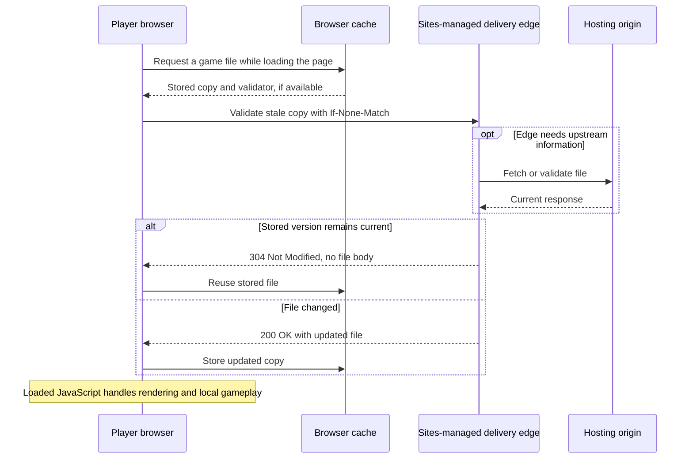

# VaVi Lantern caching

The current cache settings are intentionally unchanged. Browsers can retain downloaded files, but must validate them before reusing stale copies. Gameplay runs on the player's device once the game has loaded; caching does not cause a server request for every frame, jump or slide.

## Observed production behavior

During the September 2026 inspection, HEAD requests to `https://vavilantern.com/`, `/campaign.css`, `/game.js` and `/vavi-tech-logo.png` returned:

```http
Cache-Control: public, must-revalidate, max-age=0
CF-Cache-Status: HIT
Server: cloudflare
```

The sampled CSS, JavaScript and logo responses also included ETags. These are observations of those responses, not a guarantee for every asset or future deployment. A conditional 304 response was not separately tested.

| Setting | Meaning for the game |
|---|---|
| `public` | Shared caches may store the response. |
| `max-age=0` | The stored response becomes stale immediately; it has no positive freshness period. |
| `must-revalidate` | A stale response must be successfully validated before reuse. |
| `ETag` | A version identifier the browser can send when checking whether a stored file has changed. |
| `CF-Cache-Status: HIT` | The sampled response was served from Cloudflare's delivery cache. This does not reveal its configured lifetime or internal storage. |

## Browser cache versus hosting cache

The browser cache stores files on a visitor's device. The hosting/CDN cache stores copies within the Sites-managed delivery infrastructure. A request from the browser can be answered at the Cloudflare edge without reaching the underlying hosting origin.

The owner's Cloudflare zone uses DNS-only records. The Cloudflare-backed delivery observed here belongs to the Sites hosting integration; it is not evidence of an owner-configured Pages project or a cache rule in the domain's DNS zone. See [domain routing](DOMAIN-ROUTING.md).



This diagram describes conditional validation when a usable validator exists. A first visit, missing cache entry or unconditional request downloads the file normally. Revalidation still involves a network round trip, even when a 304 saves downloading the body again.

There is no request for every game action in solo or same-device multiplayer. Optional online-service functionality can make network requests when configured; it is separate from static-file caching. The current static deployment does not host the optional Node race API.

## Updates and refreshes

An already-open game continues using its loaded code until the page reloads. Publishing a new Sites version does not replace JavaScript already running in that tab. GitHub commits alone also do not publish a new website version.

1. After a successful website deployment, refresh the page to load and validate its files.
2. If an old view remains, confirm the correct Sites version was published, then try a hard refresh (`Ctrl+Shift+R` on common desktop browsers).
3. A hard refresh affects browser loading; it does not purge the hosting CDN. Deployment propagation or delivery-cache behavior may still need investigation.

The inspected web code does not register a service worker or implement a Cache Storage offline layer. Browser caching alone is not a guarantee that the game will open offline.

## Saved progress is separate

Game progress is stored in `localStorage`, primarily under `vavi-lantern-levels-v2`, with legacy reads from `vavi-lantern-v1`. This is separate from the HTTP file cache. Clearing cached files is different from clearing site data; deleting site data can erase saved progress.

Storage belongs to the browser and origin. The apex domain, `www` address and `chatgpt.site` address have separate storage, as do different browsers and devices. Progress is not currently synchronized through a cloud-save service.

## Why not increase max-age now?

A longer freshness period can reduce repeat network checks, but applying it to unchanged asset filenames can leave visitors using old code until that period expires. The current revalidation policy is retained by choice.

A possible future improvement is to keep HTML revalidated while giving versioned or content-hashed JavaScript, CSS and image filenames longer caching. Each release would reference new filenames for changed assets. That requires build changes and verification that Sites supports the desired response-header controls; neither has been implemented as part of this documentation update.
