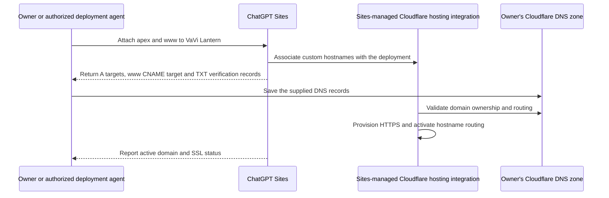
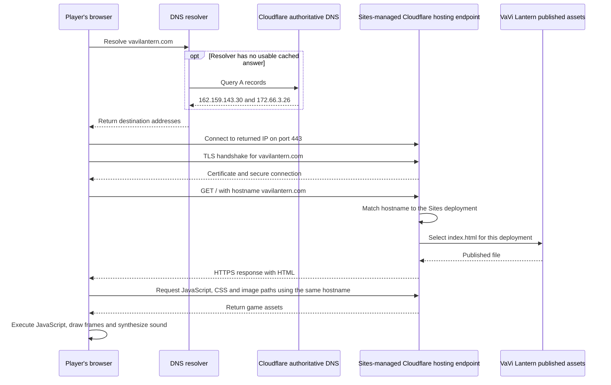
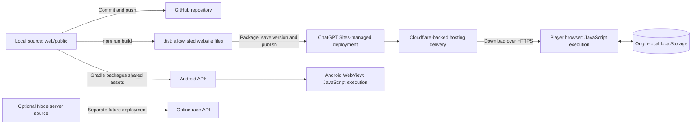

# How the domain reaches the game

This guide explains the VaVi Lantern deployment configured on September 8, 2026: who owns the IP addresses, how Sites connects a custom domain, how a browser reaches the game, and where the scripts live. The diagrams show the externally observable service boundaries, not a claim about the provider's private storage implementation.

## Cloudflare owns the IP addresses; Sites supplied the targets

| Address supplied by Sites | Cloudflare published IP range containing it |
|---|---|
| 162.159.143.30 | 162.158.0.0/15 |
| 172.66.3.26 | 172.64.0.0/13 |

Both addresses are in [Cloudflare's official IPv4 ranges](https://www.cloudflare.com/ips-v4). When the custom domain was attached, the Sites response supplied these exact values in `apex_proxy_ipv4_targets`. We copied them into the two A records in the owner's Cloudflare DNS zone. They were not guessed, and they are not the owner's PC address.

**IP network ownership and hosting management are different things.** Cloudflare operates the network addresses; ChatGPT Sites manages this website deployment and uses Cloudflare-backed infrastructure for delivery. These addresses are not unique identifiers for this game. The requested hostname distinguishes the application.

## Where the configuration was made

Two complementary configurations are needed. DNS alone cannot tell the hosting platform which game to serve.

1. In **ChatGPT Sites**, attach `vavilantern.com` and `www.vavilantern.com` to the existing VaVi Lantern project. Sites returns routing targets and domain-verification records, and manages the hosting-side custom-hostname association and HTTPS provisioning.
2. In **the owner's Cloudflare account**, open the `vavilantern.com` zone and add the A, CNAME and TXT records supplied by Sites. These publish the destinations and prove control of the domain.
3. The hosting integration validates those records and activates the custom domains and certificates. In this deployment, both reached active status.

The hostname association is managed through Sites. We did not create a Worker, Pages project or redirect rule in the owner's Cloudflare account. The DNS dashboard shows the public records, not the hosting provider's internal routing configuration. See the [hosting guide](HOSTING.md#dns-configuration-recorded-at-activation) for the seven configured records and [ChatGPT Sites](https://chatgpt.com/sites) to manage the Site.

Conceptually, the hosting association is:

| Requested hostname | Application selected by the hosting platform |
|---|---|
| vavilantern.com | VaVi Lantern deployment |
| www.vavilantern.com | VaVi Lantern deployment |
| vavi-lantern.prashanth991.chatgpt.site | VaVi Lantern deployment |

This table explains the mapping; it is not a literal configuration file uploaded to Cloudflare.

## Why the browser still knows the domain after DNS

DNS gives the browser a destination address. It does not replace or erase the URL the user opened. For `https://vavilantern.com/`, the browser retains both the IP destination and the hostname.

- **Network connection:** the browser connects to a returned IP address, normally using port 443 for HTTPS.
- **TLS:** the connection communicates the intended server name through SNI, which lets the hosting infrastructure select the relevant TLS configuration and certificate. Modern connection details can vary, but the hostname is not lost during DNS resolution.
- **HTTP:** the request identifies the website using `Host: vavilantern.com` in HTTP/1.1 or `:authority` in HTTP/2 and HTTP/3. It also includes the requested path, such as `/` or `/game.js`.
- **Hosting routing:** the hosting platform matches that hostname to the association created when Sites attached the domain, then serves the appropriate deployment's file.

The HTTP request is carried within the encrypted connection. The IP gets the request to the serving network; the hostname selects the application. A shared IP can therefore serve multiple websites.

**This is hostname routing, not an HTTP redirect to chatgpt.site.** The browser does not need to visit the platform-provided address first, and its address bar stays on the custom domain. Cloudflare does not infer the application from the IP alone or discover it from the GitHub repository on every request; the association was provisioned beforehand.

## What DNS only means here

The owner's Cloudflare zone answers DNS queries with the configured targets. DNS-only mode means that zone does not add its own HTTP proxy layer. The destination can still be Cloudflare-backed infrastructure operated for the hosting provider, as it is in this deployment. These are separate configuration boundaries, even though Cloudflare participates in both.

Changing the owner's zone to proxied would change that arrangement; it is not required merely because the game uses HTTPS. Keep the verified settings unless deliberately changing the hosting design. [Cloudflare's proxy-status documentation](https://developers.cloudflare.com/dns/proxy-status/) explains DNS-only versus proxied records.

## Where the scripts live and where they run

| Copy or environment | What it contains | What it does |
|---|---|---|
| Local repository | Shared client source in web/public plus Android and optional server source | Editing, testing and building |
| GitHub | Committed source, documentation and release downloads | Source history and distribution; not the current live game host |
| ChatGPT Sites-managed deployment | Published static game files and hosting metadata | Makes the saved website version available through its delivery infrastructure |
| Player's browser | Downloaded HTML, JavaScript, CSS and images; browser may cache assets | Runs gameplay, Canvas rendering and Web Audio locally |
| Browser localStorage | Progress, settings and local records | Persists locally per device/browser/origin |
| Android app package | Bundled copy of shared game assets | Runs in Android System WebView without needing the website host for local gameplay |
| Optional Node service | Server program, rooms and score-file logic | Not publicly deployed; does not run inside the current static website host |

The gameplay JavaScript is served as static content and executed on the player's device. It is not executing on Cloudflare to draw every game frame. The current deployment does not host the Node race service or a cloud-save database.

We can verify the Sites deployment, returned DNS targets and Cloudflare-backed delivery. We cannot identify the precise internal storage product, physical server, bucket or geographic location used for every deployed file from those observations. Do not interpret this diagram as proof of a specific R2 bucket or D1 database; none was configured for this game.

GitHub pushes do not automatically update this deployment. A website update requires the separate Sites publication workflow. See [publishing and rollback](HOSTING.md#updates-and-rollback).

## Caching after the request reaches hosting

A browser request can be answered by the Sites-managed delivery cache without reaching the hosting origin. It does not mean every gameplay action makes a network request. See [browser and hosting caching](CACHING.md) for the observed headers and conditional-request diagram.

## Technical references and diagram sources

- [Cloudflare IPv4 ranges](https://www.cloudflare.com/ips-v4)
- [Cloudflare DNS proxy status](https://developers.cloudflare.com/dns/proxy-status/)
- [TLS server-name indication, RFC 6066 section 3](https://www.rfc-editor.org/rfc/rfc6066.html#section-3)
- [HTTP Host and authority, RFC 9110 section 7.2](https://www.rfc-editor.org/rfc/rfc9110.html#section-7.2)
- [ChatGPT Sites management guide](https://learn.chatgpt.com/docs/sites)
- Editable diagrams: [domain setup](diagrams/domain-setup.mmd), [HTTPS request routing](diagrams/https-request-routing.mmd), [script delivery and execution](diagrams/script-lifecycle.mmd)
