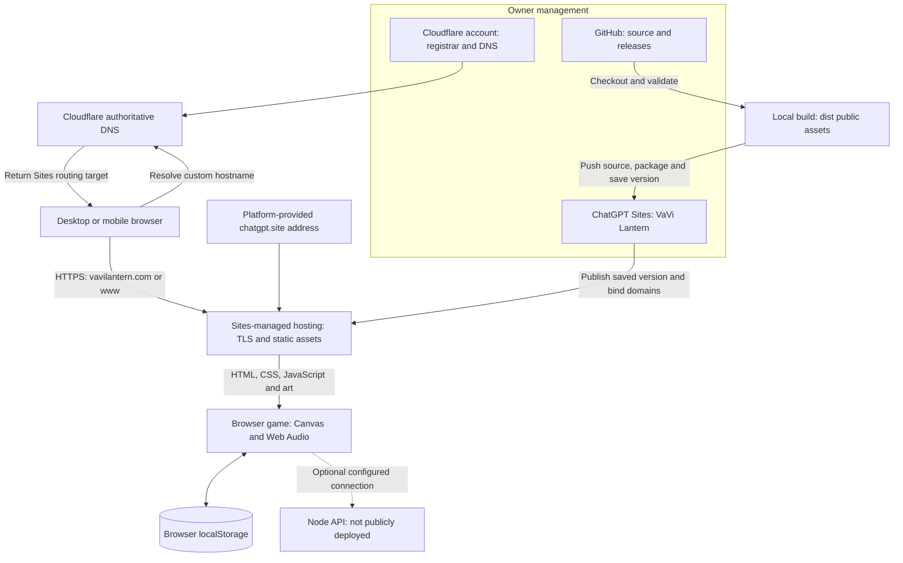

# Cloudflare and ChatGPT Sites hosting

Deployment verified September 8, 2026. Game version: **1.0.0**.

## Live addresses and dashboards

| Address | Purpose |
|---|---|
| https://vavilantern.com | Main public game address |
| https://www.vavilantern.com | Additional public address for the same deployment |
| https://vavi-lantern.prashanth991.chatgpt.site | Platform-provided address for the same deployment |
| https://chatgpt.com/sites | ChatGPT Sites management; select VaVi Lantern using the owner account/workspace |
| https://dash.cloudflare.com | Domain registration and DNS; select vavilantern.com |

All three game addresses serve the same release. The custom domains do not redirect through the platform address. Each hostname is a separate browser origin: progress, settings and records stored in localStorage do not automatically transfer between them. Share the main address consistently.

## Domain routing explained

See [how the domain reaches the game](DOMAIN-ROUTING.md) for IP ownership versus Sites hosting management, the two configuration locations, TLS and HTTP hostname routing, DNS-only behavior, and script delivery/execution. It includes separate diagrams for custom-domain setup, a visitor request and the script lifecycle.

## Responsibilities and ownership

| Component | Managed where | Current responsibility |
|---|---|---|
| Domain registration | Owner's Cloudflare account | Ownership and renewal of vavilantern.com |
| Authoritative DNS | Owner's Cloudflare zone | A, CNAME and TXT records connecting the domain to Sites |
| Static application hosting | ChatGPT Sites | Saved website versions, public deployment and asset delivery |
| Custom hostname HTTPS | Sites-managed hosting integration | Domain validation, certificate provisioning and routing to the deployment |
| Source and release downloads | VaVi-Tech24/VaViLantern on GitHub | Version history, documentation, APK, AAB and website ZIP |
| Local development | Repository and localhost:8787 | Editing and testing; not required for the public website to stay online |
| Multiplayer API | Not publicly deployed | Optional Node service for online races and the world board |

No Cloudflare Pages project or owner-managed Worker was deployed in your Cloudflare account. Sites manages its hosting infrastructure, which uses Cloudflare-backed delivery. Your DNS records are currently **DNS only**. That means your zone is providing DNS resolution, not an additional proxy layer where your zone's HTTP caching, WAF or redirect rules automatically apply. The hosting provider's delivery infrastructure is a separate layer. See [Cloudflare proxy status](https://developers.cloudflare.com/dns/proxy-status/).

## Request and publishing paths

The DNS lookup discovers the destination; it does not carry game frames. After asset loading, the browser runs simulation, rendering, audio and local saves. Solo and same-device multiplayer need no hosted API. Neither purchasing the domain nor publishing static files deploys the optional Node service.

## DNS configuration recorded at activation

All records were imported with a five-minute TTL. A and CNAME records use DNS-only mode. These are the targets returned for this deployment, not universal values to copy for another site.

| Type | Name relative to vavilantern.com | Value / purpose |
|---|---|---|
| A | @ | 162.159.143.30 |
| A | @ | 172.66.3.26 |
| CNAME | www | custom-domains.chatgpt.site. |
| TXT | _openai-site-verification | Sites-provided ownership verification value |
| TXT | _openai-site-verification.www | Sites-provided www ownership verification value |
| TXT | _cf-custom-hostname | Hosting provider's apex verification value |
| TXT | _cf-custom-hostname.www | Hosting provider's www verification value |

The exact TXT values remain in Cloudflare DNS. Preserve the validation records; obtain fresh instructions from Sites if reattaching a domain. Do not substitute a CNAME pointing to the public game URL or toggle proxy mode as a speculative fix. Both custom domains reached active routing and active SSL status, and the game loaded over HTTPS.

## HTTPS certificates

Verified September 9, 2026 at 00:25 UTC (September 8 in Toronto): Sites reported active domain routing and active SSL status for both addresses.

| Hostname | Domain status | Certificate status |
|---|---|---|
| vavilantern.com | Active | Active |
| www.vavilantern.com | Active | Active |

HTTPS encrypts traffic between the visitor's browser and the website host. Certificate provisioning is handled by the Sites-managed hosting integration; the owner does not need to purchase or manually install a certificate for this deployment. Keep the custom domains attached and preserve their DNS verification records.

This is a dated status check, not a guarantee of future availability. The status response did not include certificate issuer or expiry details. For future checks, inspect the browser's certificate information and the Sites custom-domain SSL status. Certificate setup does not provide player accounts, cloud saves or a hosted multiplayer API.

## What was uploaded

The deployment contains twelve public files plus hosting metadata: index.html, style.css, campaign.css, engine.js, game.js, characters.js, sound.js, online.js, cosmic-lantern.png, vavi-tech-logo.png, jonah-run.png and logo.svg. The build script explicitly allowlists these files. Android binaries, private signing keys, local tools, tests and the Node server are not in the static deployment.

The .openai/hosting.json file binds this checkout to the existing Sites project and selects dist as its static directory. Retain this binding when updating. Deployment archives and short-lived source credentials are operational artifacts, not public repository content.

## Updates and rollback

1. Edit the shared web/public source and run checks appropriate to the change. Run npm test for gameplay changes and npm run test:playability for campaign/physics changes.
2. Run npm run build and inspect the generated dist output. Check desktop and phone layouts when changing the interface.
3. Commit the tested source. Push it to GitHub for version history and to the existing Sites source repository using the hosting workflow's short-lived credential. Never store a credential in Git configuration or documentation.
4. Package the validated output with the Sites packaging helper. Save a version referencing the exact pushed source commit and that archive.
5. Publish the saved version to the existing public Site. Wait for deployment success, then verify the main domain and important assets.
6. If an update breaks production, republish a known-good saved Sites version through the supported deployment workflow. Reverting Git alone does not change the live website.

GitHub pushes do not trigger automatic website deployment in this setup. Documentation-only commits do not require republishing the game. Website deployments do not rebuild Android; a changed mobile package requires a separate build and release.

## Availability, renewal and troubleshooting

The deployed game does not depend on the developer's PC or local preview server remaining on. Domain registration and hosting are separate dependencies: keep the Cloudflare registration renewed and the Sites account eligible. No indefinite hosting guarantee is assumed. Sites is a beta service with plan-specific limits; check the current dashboard and [official Sites guide](https://learn.chatgpt.com/docs/sites) for current availability and usage conditions.

| Symptom | First checks |
|---|---|
| Domain does not resolve | Cloudflare zone, domain registration, A/CNAME records and resolver caches |
| Certificate warning | Sites custom-domain SSL status and validation records; never bypass the warning |
| Domain returns 404 while platform address works | Custom-domain activation and routing; allow provisioning to complete |
| Old game appears | Confirm the deployed saved version, then browser cache and asset URLs |
| Progress appears missing on another URL/device | localStorage is specific to each origin and browser; there is no cloud save |
| Online race or leaderboard unavailable | The separate Node API is not hosted; static deployment cannot provide these routes |

The Sites dashboard is for managing the hosted Site. GitHub is the source-code browser, and Cloudflare DNS is the domain-routing editor. Changing the domain does not move hosting into a Cloudflare Pages or Workers project owned by this account.
