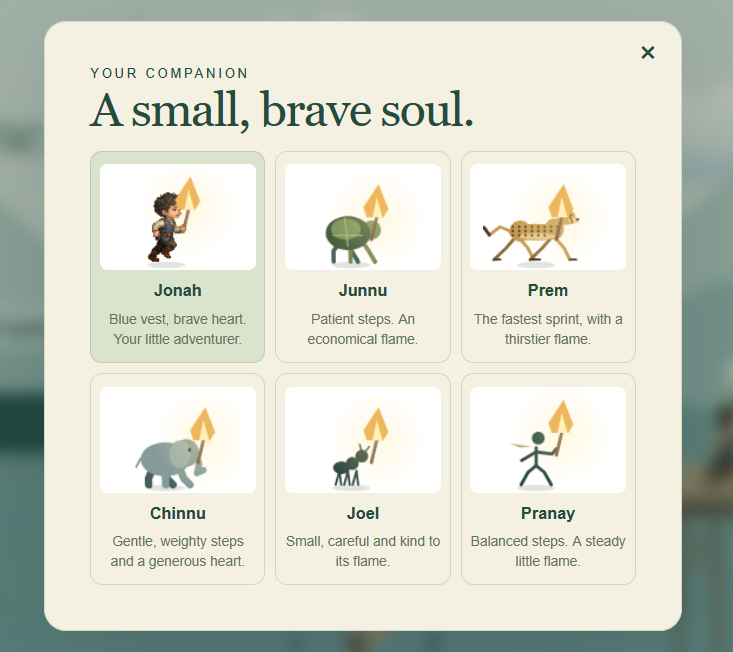
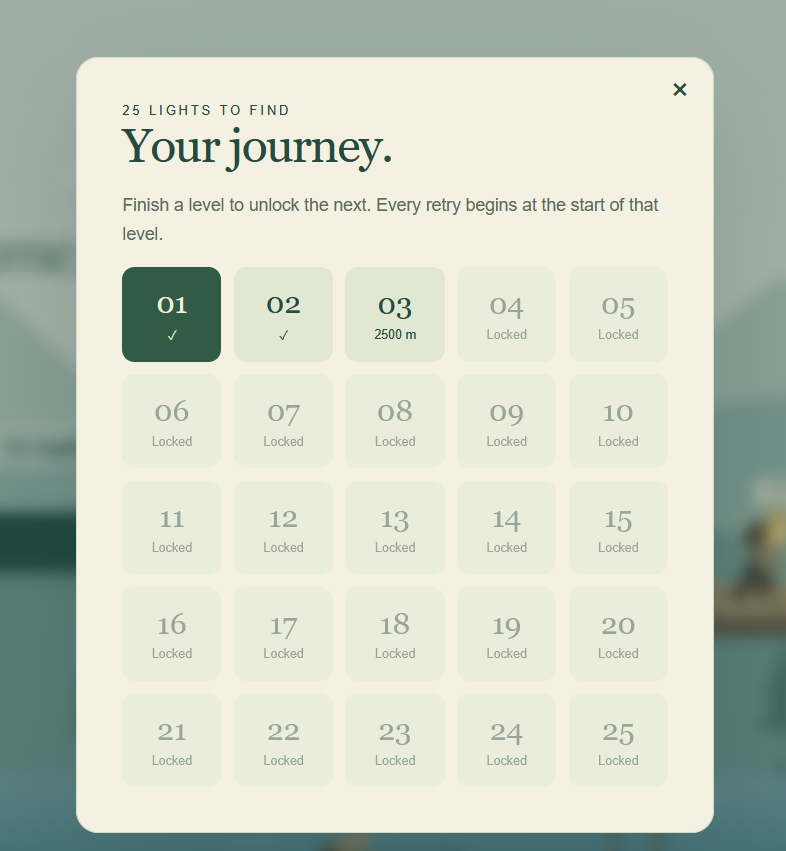
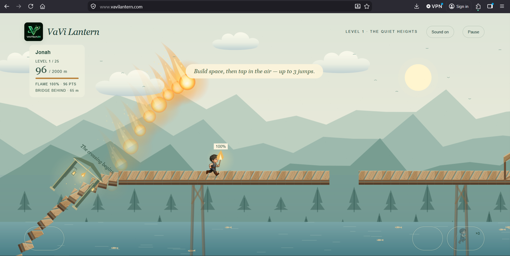
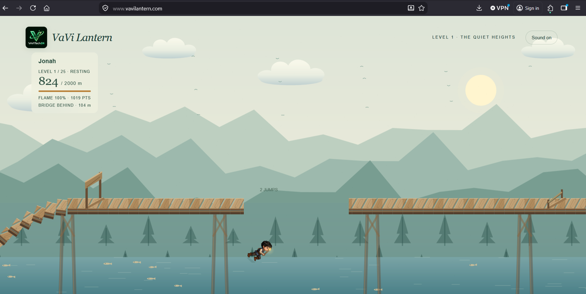
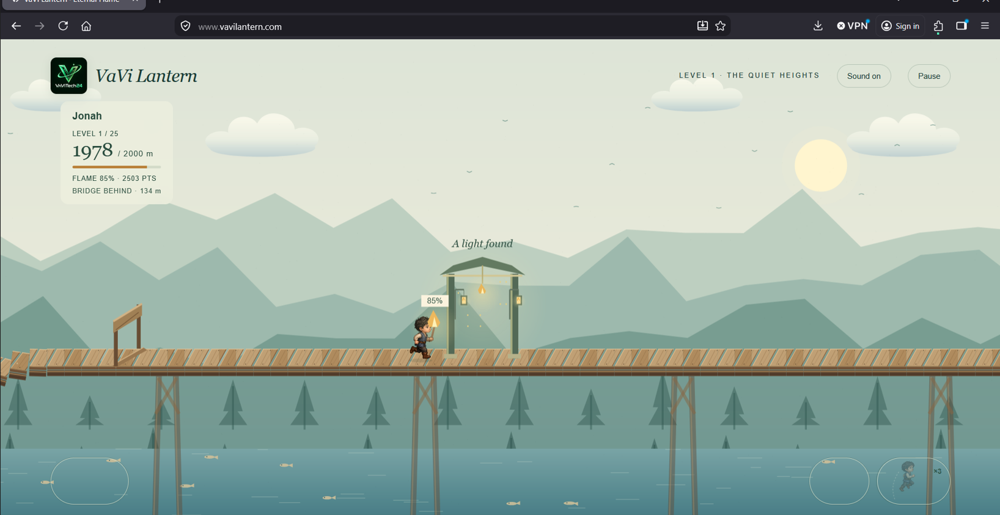
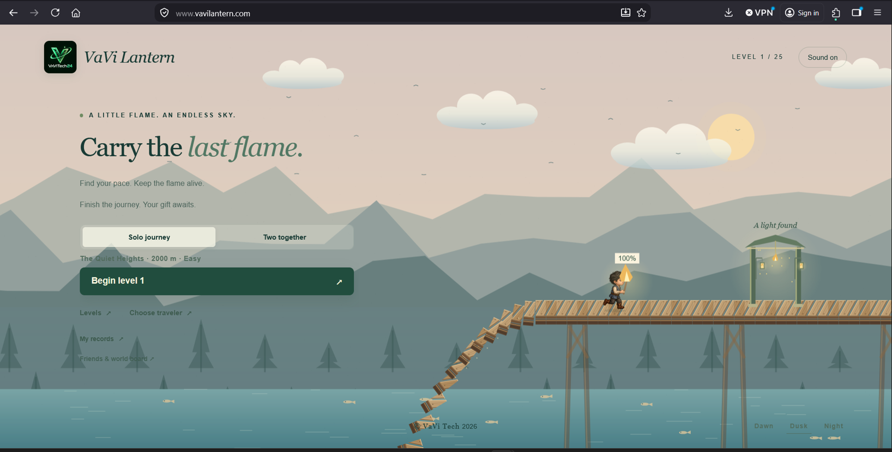
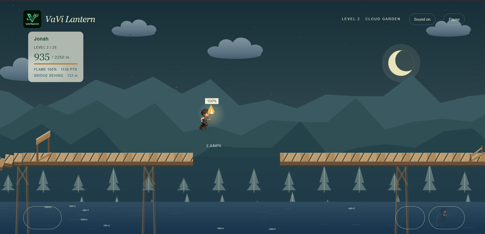

# VaVi Lantern screenshot gallery

Screenshots supplied by the project owner on September 8, 2026. These original PNG files are preserved without cropping or editing. They document the captured game state; future versions may look different.

[Play VaVi Lantern](https://vavilantern.com/) · [Back to the project](../README.md) · [Browse all 11 files](screenshots/2026-09-08/)

## Dawn home screen

The home screen with the journey menu, Jonah, and the collapsing wooden bridge.

## Choose a traveler

Jonah, Junnu, Prem, Chinnu, Joel, and Pranay.

## Your journey

The 25-level selection screen, showing completed, available, and locked levels.

## The crossing begins

Opening fireballs, falling planks, the flame meter, and touch controls.

## Falling toward the water

Jonah falling below the bridge after missing a crossing.

## A light found

Approaching the gateway near the end of the first 2,000-meter level.

## Dusk home screen

The warm dusk palette across the sky, mountains, bridge, and water.

## Night crossing

A midair jump in level two beneath the moon and stars.

## Additional supplied captures

The three clipboard attachments repeat scenes above and are also preserved in the repository:

- [Traveler selection, clipboard capture 1](screenshots/2026-09-08/09-travelers-clipboard.png)
- [Traveler selection, clipboard capture 2](screenshots/2026-09-08/10-travelers-clipboard.png)
- [Opening fireballs, clipboard capture](screenshots/2026-09-08/11-opening-fireballs-clipboard.png)
