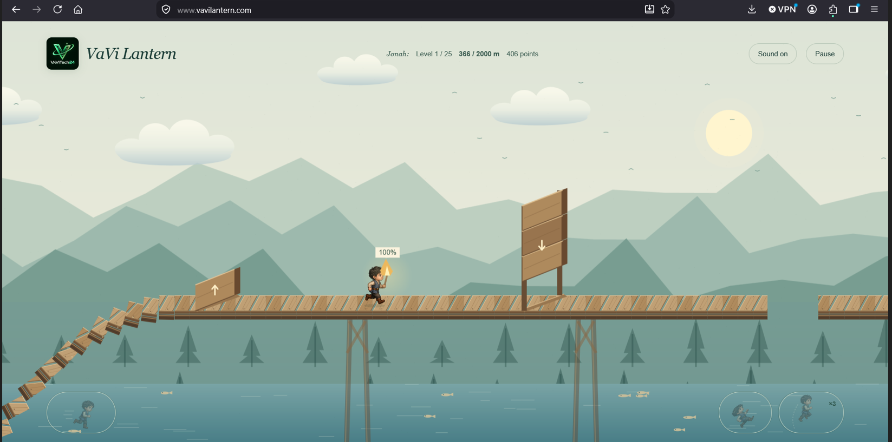
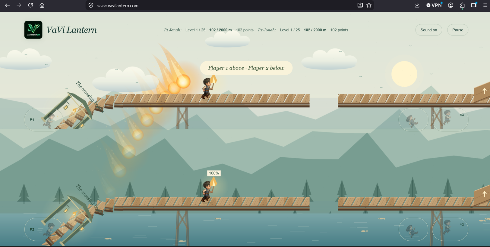
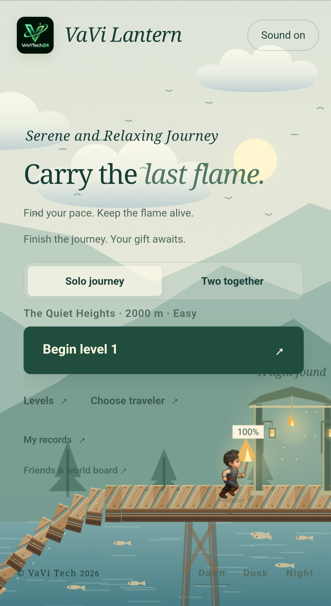
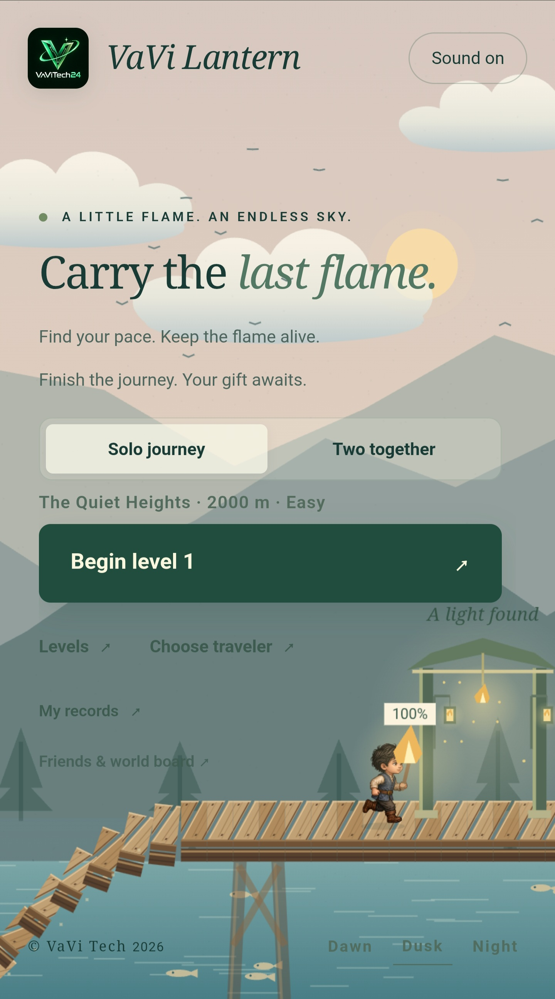
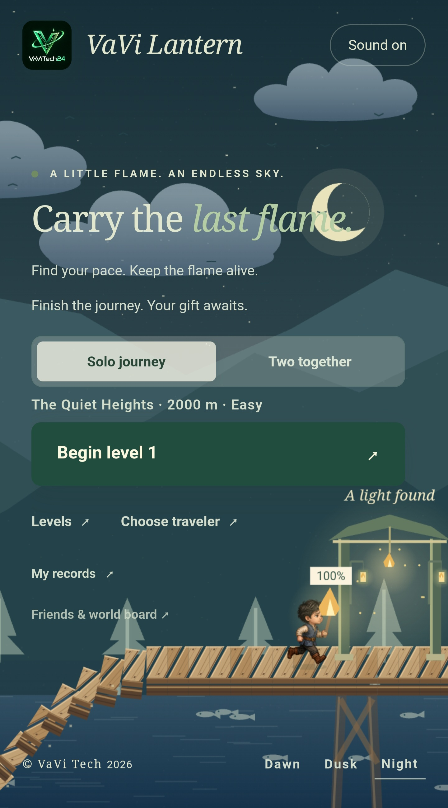
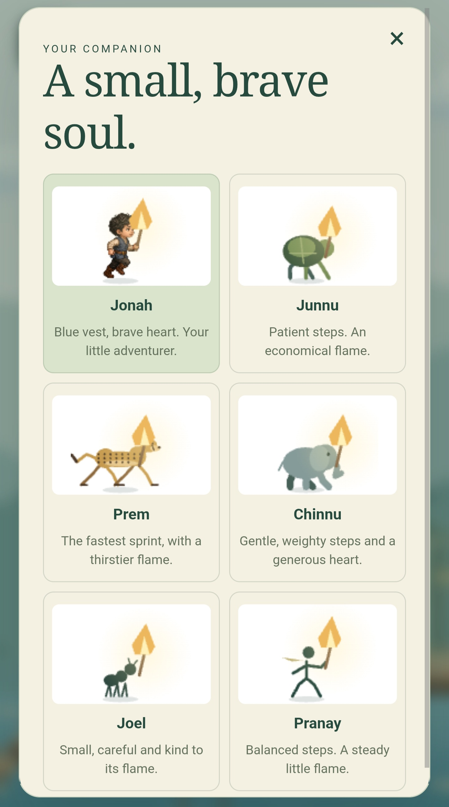
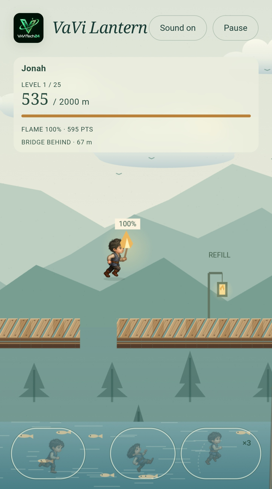

# VaVi Lantern screenshot gallery

Screenshots supplied by the project owner on September 8–9, 2026. These original PNG and JPEG files are preserved without cropping or editing. They document the captured game state; future versions may look different.

[Play VaVi Lantern](https://vavilantern.com/) · [Back to the project](../README.md) · [Desktop files](screenshots/2026-09-08/) · [Mobile files](screenshots/2026-09-09-mobile/)

The desktop and portrait dawn home screenshots were refreshed on September 9, 2026 with the new “Serene and Relaxing Journey” tagline. Existing image paths are retained so README and gallery links remain stable.

## Updated gameplay screenshots

### Solo journey: timber obstacles

Solid wooden jump and slide barriers with directional arrows, plus the compact stats header.

### Local multiplayer: two together

Two players share one screen on separate bridges, with individual stats and controls. Player 1 runs above; player 2 runs below.

## Portrait mobile screenshots

Supplied September 9, 2026. Select an image to view its original resolution.

| Dawn home | Dusk home | Night home |
|---|---|---|
|  |  |  |

| Choose a traveler | Jump and flame refill |
|---|---|
|  |  |

The repeated [dawn clipboard capture](screenshots/2026-09-09-mobile/06-home-dawn-clipboard.jpg) is also preserved. The supplied [VaViTech24 logo](images/vavi-tech24-logo.jpg) appears below the opening description in the project README.

## Dawn home screen

The home screen with the journey menu, Jonah, and the collapsing wooden bridge.

## Choose a traveler

Jonah, Junnu, Prem, Chinnu, Joel, and Pranay.

## Your journey

The 25-level selection screen, showing completed, available, and locked levels.

## The crossing begins

Opening fireballs, falling planks, the flame meter, and touch controls.

## Falling toward the water

Jonah falling below the bridge after missing a crossing.

## A light found

Approaching the gateway near the end of the first 2,000-meter level.

## Dusk home screen

The warm dusk palette across the sky, mountains, bridge, and water.

## Night crossing

A midair jump in level two beneath the moon and stars.

## Additional supplied captures

The three clipboard attachments repeat scenes above and are also preserved in the repository:

- [Traveler selection, clipboard capture 1](screenshots/2026-09-08/09-travelers-clipboard.png)
- [Traveler selection, clipboard capture 2](screenshots/2026-09-08/10-travelers-clipboard.png)
- [Opening fireballs, clipboard capture](screenshots/2026-09-08/11-opening-fireballs-clipboard.png)
