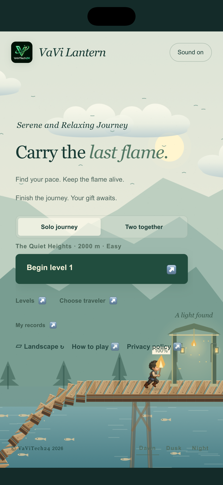
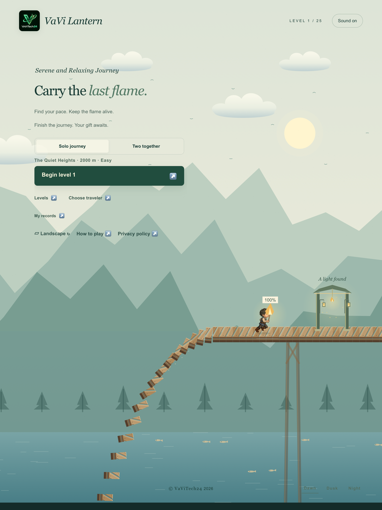

# iOS simulator screenshots

Captured September 24, 2026 (America/Toronto) from the running VaViLantern iOS app, version 1.0.0 build 1, using Xcode 27 / iOS 27 simulators. These are original PNG screenshots, not Android images or browser mockups. No resizing, cropping or artwork edits were applied.

The [Android gallery](../2026-09-12-google-play/README.md) was used as the content reference. This first set contains the equivalent portrait home screen on iPhone and iPad. Traveler selection and landscape gameplay captures remain pending because Device Hub's automated control interface timed out. This is not the complete equivalent of the eight-image Android gallery.

| Device | Original size | App Store Connect slot | Screenshot |
| --- | --- | --- | --- |
| iPhone 18 Pro Max | 1320 × 2868 | iPhone 6.9-inch | [Download PNG](iphone/01-home-portrait.png) |
| iPad Pro 13-inch (M5) | 2064 × 2752 | iPad 13-inch | [Download PNG](ipad/01-home-portrait.png) |

If App Store Connect initially shows the iPhone 6.5-inch slot, use **View All Sizes in Media Manager** and select **6.9-inch** for this iPhone capture. Do not upload it to the 6.5-inch slot. See [Apple's screenshot specifications](https://developer.apple.com/help/app-store-connect/reference/app-information/screenshot-specifications).

## iPhone

## iPad

These captures demonstrate simulator rendering, not physical-device testing or App Store approval.
