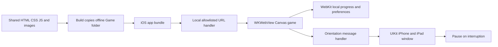

# VaVi Lantern for iPhone and iPad

**Status: simulator build and first launch verified on September 21, 2026 with Xcode 27.0 and the iOS 27.0 iPhone 18 Pro simulator.** The home screen renders and the existing `tests/ios-offline.test.cjs` bundle checks pass. Physical-device gameplay, signing, archive validation, TestFlight and App Store submission remain pending. The project is now on an Apple M2 Pro Mac; the owner does not yet have Apple Developer Program membership.

This is an iOS application target, not a converted APK. Swift/UIKit hosts the existing offline Canvas game in WKWebView. It includes solo and same-device two-player play, all 25 levels, six travelers, procedural sound, gesture guidance, local records, portrait and landscape. It does not load vavilantern.com.

The owner also confirmed testing in Device Hub's simulator on September 22, 2026. This does not yet cover testing on a physical iPhone or iPad.

## Open and build on a Mac

1. Install the current stable Xcode with the iOS 26 SDK or later; open it once to finish installing components.
2. Clone/download the **whole repository**. This project needs the shared `web/public` directory.
3. In Terminal at the repository root, run `sh ios/prepare-assets.sh` once, then open `ios/VaViLantern.xcodeproj`.
4. Select the VaViLantern scheme and an iPhone simulator, then Run. A developer membership is not needed for simulator builds.
5. For device testing, select your Apple account/team under Signing & Capabilities. Automatic signing is enabled; no team ID or certificates are committed.

The build phase refreshes the game assets on every build. Initial preparation ensures Xcode can discover the generated Game resource folder before its first build plan. There are no CocoaPods, third-party SDKs or package downloads.

Simulator build from the repository root:

```sh
sh ios/prepare-assets.sh
xcodebuild -project ios/VaViLantern.xcodeproj -scheme VaViLantern \
  -configuration Debug -sdk iphonesimulator -destination 'generic/platform=iOS Simulator' \
  -derivedDataPath ios/build CODE_SIGNING_ALLOWED=NO build
```

## Configuration and code map

| File | Purpose |
| --- | --- |
| `VaViLantern.xcodeproj/project.pbxproj` | Target, signing, resources, version and minimum OS |
| `VaViLantern/AppDelegate.swift` | App entry point and scene configuration |
| `VaViLantern/SceneDelegate.swift` | Window, background pause and idle timer |
| `VaViLantern/GameViewController.swift` | WKWebView, safe areas, native orientation and navigation restrictions |
| `VaViLantern/BundledGameHandler.swift` | Allowlisted local resources at `vavi-game://localhost`; no internet server |
| `prepare-assets.sh` | Copies shared game; substitutes offline adapter for online.js |
| `Offline/offline.js` | Native landscape button and in-app privacy information |
| `VaViLantern/Info.plist` | App identity, scene lifecycle and orientations |
| `VaViLantern/PrivacyInfo.xcprivacy` | Current source declares no tracking, collection or required-reason API use |
| `VaViLantern/Assets.xcassets` | Opaque 1024px app icon; in-game company logo remains shared website artwork |

Default bundle ID: `com.vavitech24.lantern` (must be registered under your Apple team before release). Version: **1.0.0**, iOS build **1**, independent of Android build 32. Minimum deployment target: **iOS/iPadOS 16.4**; the build SDK requirement is separate from the minimum device OS.



Content Security Policy blocks network connections and frames; native navigation accepts only the bundled game page. No advertising or analytics frameworks are linked. WebKit local storage uses a stable origin and the default persistent store. Apple backups may include app data; there is no developer-operated cloud sync. Audio starts through a player gesture. Returning from an interruption leaves a running level paused.

## Verification still required on Apple hardware

- Build with Xcode and resolve any compiler, asset-catalog or archive validation errors.
- Launch offline on a clean installation, complete a level, force-quit and reopen: verify progress and settings persist.
- Check iPhone and iPad in both orientations, notches/safe areas, Landscape/Auto rotate, dialogs and two-player controls.
- Check tap, swipe up, swipe down and hold, plus the three-second first-level gesture hints.
- Check sound on a physical device, mute toggling, notifications/app switching, lock/unlock and manual resume.
- Check denied/non-game navigation, local privacy dialog, memory-pressure recovery and zero game network traffic.
- Run Xcode Analyze, archive validation and privacy report review, then TestFlight with real testers. Windows JavaScript tests do not replace these checks.

See [App Store preparation](../docs/APP_STORE.md) for enrollment, listing and release steps.
